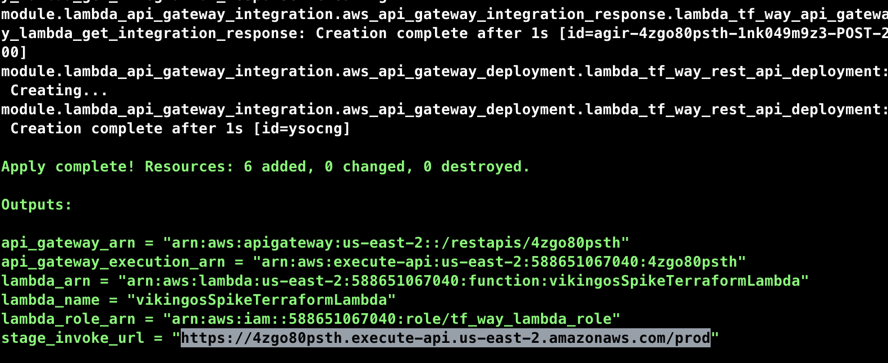
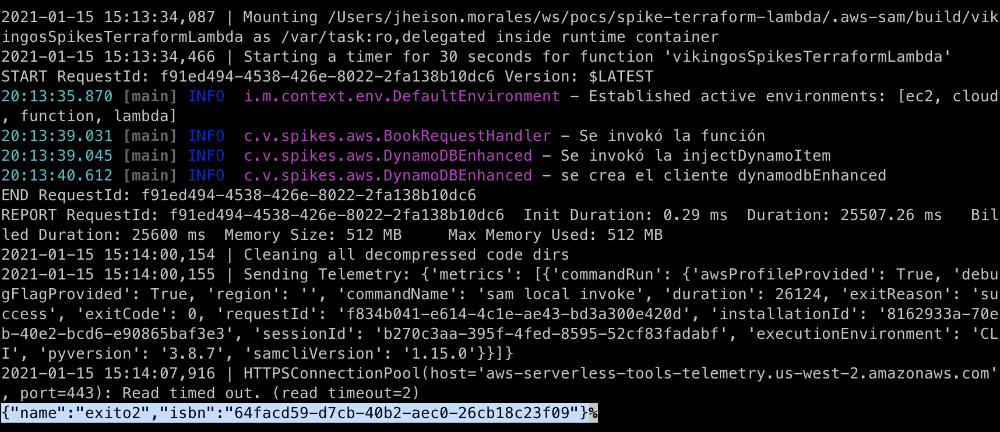
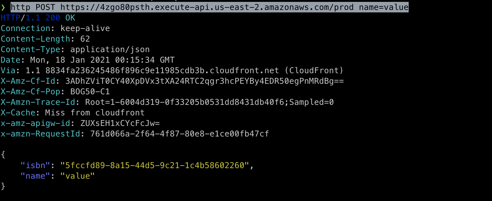
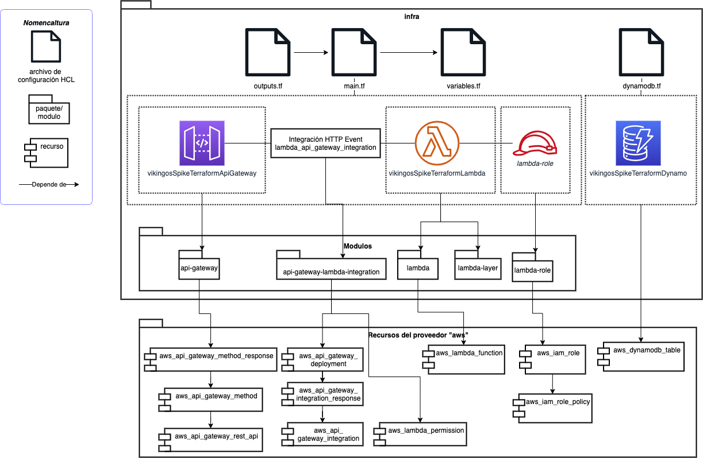

# spike-terraform-lambda

Trabajo realizado para la célula "Vikingos":


## Contenido

1. [Objetivos](#1-objetivos)
2. [Introducción](#2-introducción)
3. [Conceptos](#3-conceptos)
4. [Diseño PoC](#4-diseño-de-la-poc)
5. [Configuración del ambiente de desarrollo](#5-configuración-del-ambiente-de-desarrollo)
6. [Detalles de implementación](#6-detalles-de-implementación)
7. [Referencias](#7-referencias)


## 1. Objetivos

- Comprender el funcionamiento de Terraform y su aplicación para la creación de infraestructura como código.
- Entender el funcionamiento y configuración de las lambdas en AWS.
- Implementar un demo sencillo utilizando Terraform y lambdas.


## 2. Introducción

Spike sobre el uso del lenguaje HCL para la creación y gestión de lambdas en aws. En este caso particular se crea una lambda en nodejs activada por un trigger del API Gateway. Tutorial pensado para quienes tienen cero experiencia con Terraform. Los modulos para este laboratorio fueron obtenidos del repo https://github.com/nsriram/lambda-the-terraform-way/.

## 3. Conceptos

### 3.1 Infraestructura como código
- Introducción a HCL

Diagrama esquematico funcionamiento de Terraform:


- modulos
- provedores
- recursos


### 3.2 AWS Lambda con Micronaut

#### 3.2.1 Lambda

- Runtime (Java 11, Coretto)
- IAM (https://github.com/nsriram/lambda-the-terraform-way/blob/master/docs/04-iam-account-setup.md)

- Layers

Diagrama esquematico layers


- Desencadenadores 

Diagrama esquematico modelo lambda


#### 3.2.2 API Gateway

_API REST_

Una colección de métodos y recursos HTTP que se integran con puntos de enlace HTTP back-end, funciones Lambda u otros servicios de AWS. Puede implementar esta colección en una o más etapas. Normalmente, los recursos de la API se organizan en un árbol de recursos según la lógica de la aplicación. Cada recurso de API puede exponer uno o más métodos de API que tienen verbos HTTP únicos compatibles con API Gateway.

_API HTTP_
Una colección de rutas y métodos que están integrados con puntos de enlace HTTP backend o funciones Lambda. Puede implementar esta colección en una o más etapas. Cada ruta puede exponer uno o más métodos API que tienen verbos HTTP únicos compatibles con API Gateway.

_WebSocket API_
Una colección de rutas de WebSocket y claves de ruta que están integradas con puntos de enlace HTTP backend, funciones Lambda u otros servicios de AWS. Puede implementar esta colección en una o más etapas. Los métodos API se invocan a través de conexiones WebSocket frontend que puede asociar con un nombre de dominio personalizado registrado.

Para mayor información sobre las diferencias puede ir a https://docs.aws.amazon.com/apigateway/latest/developerguide/http-api-vs-rest.html

### 3.3 Buenas practicas y recomendaciones

TODO

## 4. Diseño de la PoC

A continuación se presenta un esquema de la PoC

Diagrama estructura PoC


Diagrama comportamiento PoC


Ejemplo request:

```json
{
    "name": "value1"
}
```

Ejemplo response:

```json
{
    "name": "value1",
    "isbn": "xxxxx"
}
```

Para generar el fatjar que se subirá al lambda utilice la siguiente instrucción:

```sh
./gradlew shadowJar
```

## 5. Configuración del ambiente de desarrollo


- IDE decente
- Una cuenta de AWS
- JDK Java 11, instrucciones con [jenv](https://github.com/jenv/jenv)
- Terraform con [tfenv](https://github.com/tfutils/tfenv)
- Tener instalado AWS Cli v2, [instrucciones](https://docs.aws.amazon.com/cli/latest/userguide/install-cliv2.html)

Para realizar el ciclo de Terraform use los siguientes comandos:

```sh
terraform init
terraform plan
terraform apply --auto-approve  
```


Pasos para instalar el AWS SAM CLI:
```sh
brew tap aws/tap
brew install aws-sam-cli
```

Verifique la instalación

```sh
sam --version
```

Debería ver el siguiente mensaje del  AWS SAM CLI:

 SAM CLI, version 1.15.0

Para construir el entorno de pruebas local:

```sh
sam build
```

Para realizar las pruebas locales
```sh
echo '{"name": "value1" }' | sam local invoke --event - --debug --profile "$AWS_PROFILE"
```



Para realizar las pruebas remoto, solo lambda, sin pasar por el api gateway
```sh
aws lambda invoke --function-name helloWorldLambda \
    --log-type Tail \
    --payload '{"name":"hola"}' \
    --profile "$AWS_PROFILE" outputfile.txt
```

Para realizar las pruebas a través del api gateway (requiere tener instalado [HTTPie](https://httpie.io/docs)):

```sh
http POST https://4zgo80psth.execute-api.us-east-2.amazonaws.com/prod name=value
```



## 6. Detalles de implementación

Diagrama de despliegue/Estructura proyecto infra:


## 7. Referencias:

1. [Tutorial Hashicorp](https://learn.hashicorp.com/tutorials/terraform/infrastructure-as-code?in=terraform/aws-get-started)

2. [Lambda the Terraform Way](https://github.com/nsriram/lambda-the-terraform-way)

3. [Deploy a Serverless Micronaut function to AWS Lambda Java 11 Runtime](https://guides.micronaut.io/mn-serverless-function-aws-lambda/guide/index.html)

4. [Serverless SAM CLI](https://docs.aws.amazon.com/serverless-application-model/latest/developerguide/serverless-sam-cli-using-invoke.html)

5. [Creating your first AWS Java web application](https://github.com/awsdocs/aws-doc-sdk-examples/tree/master/javav2/usecases/creating_first_project)

7. [API Gateway: HTTP API vs REST](https://docs.aws.amazon.com/apigateway/latest/developerguide/http-api-vs-rest.html)