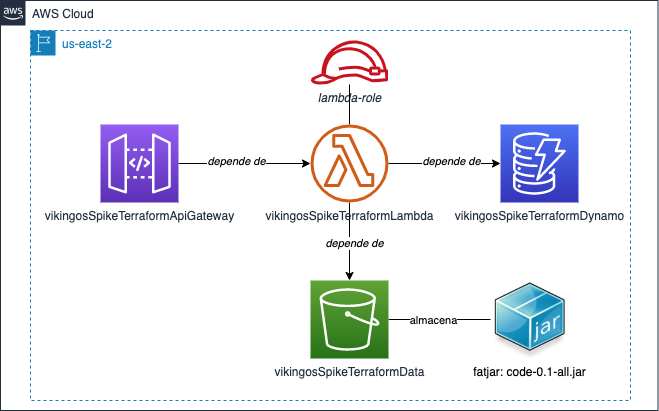
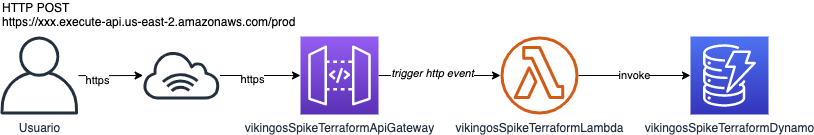

# spike-terraform-lambda
Spike sobre el uso del lenguaje HCL para la creación y gestión de lambdas en aws. En este caso particular se crea una lambda en nodejs activada por un trigger del API Gateway. Tutorial pensado para quienes tienen cero experiencia con Terraform. Los modulos para este laboratorio fueron obtenidos del repo https://github.com/nsriram/lambda-the-terraform-way/.


## Contenido

1. [Objetivos](#1-objetivos)
2. [Introducción](#1-introducción)
3. [Conceptos](#1-conceptos)
4. [Diseño PoC](#4-diseño-de-la-poc)
5. [Configuración del ambiente de desarrollo](#5-configuración-del-ambiente-de-desarrollo)
6. [Detalles de implementación](#6-detalles-de-implementación)
7. [Referencias](#7-referencias)


## 1. Objetivos

- Comprender el funcionamiento de Terraform y su aplicación para la creación de infraestructura como código.
- Entender el funcionamiento y configuración de las lambdas en AWS.
- Implementar un demo sencillo utilizando Terraform y lambdas.


## 2. Introducción


## 3. Conceptos

### 3.1 Infraestructura como código
- Introducción a HCL
- modulos
- provedores
- recursos

### 3.2 AWS Lambda con Micronaut
- Runtime (Java 11, Coretto)
- IAM (https://github.com/nsriram/lambda-the-terraform-way/blob/master/docs/04-iam-account-setup.md)
- Layers
- Desencadenadores 
- API Gateway
- Diferecias entre API HTTP y API REST
- Seguridad

### 3.3 Buenas practicas y recomendaciones


## 4. Diseño de la PoC

A continuación se presenta un esquema de la PoC


Diagrama estructura PoC



Diagrama comportamiento PoC



Ejemplo request:

```json
{
    "name": "value1"
}
```

Ejemplo response:
```json
{
    "name": "value",
    "isbn": "xxxxx"
}
```

./gradlew shadowJar


## 5. Configuración del ambiente de desarrollo

- Terraform con tfenv
- AWS Cli v2
- JDK Java 11
- IDE decente
- Una cuenta de AWS

- Creación Key desde el portal para el cli

reutilizar ese cli para el modulo iam de terraform


Terraform Apply
After setting TF_VAR_keybase_id environment variable, lets run terraform apply.

```sh
terraform init
terraform apply --auto-approve  
```

## 6. Detalles de implementación


## 7. Referencias:

1. [Tutorial Hashicorp](https://learn.hashicorp.com/tutorials/terraform/infrastructure-as-code?in=terraform/aws-get-started)

2. [Lambda the Terraform Way](https://github.com/nsriram/lambda-the-terraform-way)

3. [Deploy a Serverless Micronaut function to AWS Lambda Java 11 Runtime](https://guides.micronaut.io/mn-serverless-function-aws-lambda/guide/index.html)

